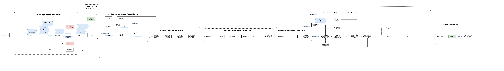

# Check Employment Status for Tax Frontend

## Description

This is a frontend µ-service providing a user interface to check an employment status for tax purposes.

This frontend interfaces with a backend µ-service [(off-payroll-decision)](http://www.github.com/hmrc/off-payroll-decision) which contains the rules engine for determining the employment status.  

### Frontend UI Journey diagram



### Running the application locally
To run the application with PDF Generation off:

```
sbt "run 9843"

```

To run the application with PDF Generation on:

```
sbt "run 9843" -DoffPayrollPdf=true

```

To check the latest dependency versions:
```
sbt dependencyUpdates

```

## License
This code is open source software licensed under the [Apache 2.0 License]("http://www.apache.org/licenses/LICENSE-2.0.html")
